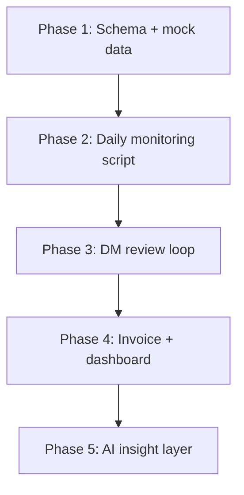

# Vendor & Subcontractor Workforce System — Architecture Plan

2026-09-19 · @Paarth Sahni

Built for Akanksha, who runs vendor management alone today via a manual Excel-driven process. Goal: automate SOW/DOJ monitoring, 3/6/9-month workforce reviews, and email follow-ups, on Google Workspace, starting as a single-user tool that can grow later.

## 1. Solution architecture: single user today, room to grow

Apps Script on Google Sheets is the right starting point. The risk isn't choosing it now — it's not knowing when to leave it.

| Stage | Users | Data layer | Automation | Access control |
| --- | --- | --- | --- | --- |
| Now (MVP) | Akanksha only | Google Sheet | Apps Script (bound to sheet) | Not needed — one owner |
| Growth | Akanksha + 2–3 team members | Same Sheet | Same Apps Script | Sheet-level sharing (view/edit tabs) — workable but messy past \~3 people |
| Team-scale | Full Vendor Mgmt team | Migrate to Firestore or a small SQL DB | Small web app (front end) + Apps Script or Cloud Functions for email/triggers | Real login, roles, audit log |

**Decision:** build the MVP in Apps Script + Sheets now. Design the schema (below) so column names and structure map cleanly onto a real database later — no rework of the data model, only a rebuild of the interface if/when the team grows. Do not build the web app now; there's no team to justify the extra infrastructure and maintenance burden for a single user.

**Trigger point to reconsider:** if headcount on vendor management grows past \~3 people, or if multiple people need to edit resource records simultaneously, that's the signal to migrate the data layer — not before.

## 2. Dev workflow: where and how the code gets written

Three real options, not two — "VS Code" and "Apps Script" aren't opposites:

| Option | What it is | Pros | Cons |
| --- | --- | --- | --- |
| Apps Script online editor | Write code directly in script.google.com | Zero setup, fastest to start | No git, no local testing, harder to review changes over time |
| **clasp + VS Code** | Google's official CLI; write in VS Code, push/pull to the real Apps Script project | Real editor, git history, same Apps Script runtime underneath — nothing else to host | Small one-time setup (Node.js + clasp login) |
| Full custom web app (VS Code, Node/Python, hosted DB) | A real standalone application | Full control, scales cleanly to a team | Needs hosting, auth, ongoing maintenance — too much for one user right now |

**Recommendation: clasp + VS Code, deploying to Apps Script.** This gets proper version control and a real editor without taking on hosting or infrastructure for a single-user tool. It also isn't a dead end — the same codebase carries forward if the system later needs to move to a hosted web app; only the front end changes, not the logic.

**Tooling note:** since the workflow is clasp + VS Code, doing the actual build in **Claude Code** (desktop or terminal) is a strong fit — it can work directly with the local clasp-synced project files, run `clasp push` to deploy, and iterate against the Apps Script runtime without every function being hand-written line by line.

**Setup needed once:** Node.js installed, `npm install -g @google/clasp`, `clasp login` (authorizes against the Google account that owns the Sheet), then `clasp clone` to pull the Apps Script project into a local folder VS Code can open.

## 3. Delivery Manager response capture

This is for the internal Delivery Manager's 3/6/9-month assessment, not a vendor-facing form. Needs validation with Akanksha before locking in, since it depends on how DMs are used to responding.

| Option | Effort to build | DM experience | Reliability |
| --- | --- | --- | --- |
| Google Form | Low | Click emailed link, fill structured form | High — responses land in a linked Sheet automatically |
| Apps Script web app (HtmlService) | Medium | Click link, see a branded mini-page, same fields | High, more setup |
| Email reply parsing (DM just replies in free text) | High | Zero friction, most natural for DMs | Low — free text is hard to parse reliably, risk of dropped/misread responses |

**Recommendation:** build the Google Form first for the MVP — fastest to stand up and test end-to-end. Both the Form and the web-app option feed the exact same backend logic (a "response submitted" trigger that updates the Resource Master), so switching from Form to web app later is a small change, not a rebuild.

**Needs confirmation from Akanksha:** whether Delivery Managers will actually engage with a Form, or whether reply-based capture is worth the extra reliability risk for the sake of adoption.

## 4. Recommended build plan

| Phase | What gets built | Depends on |
| --- | --- | --- |
| 1. Foundation | Resource Master schema (existing columns + Resource ID, SOW Start Date, Review dates/status, DM email, etc.), Config tab, Action Log tab, mock data generated from the known column list | Nothing — can start immediately |
| 2. Automated monitoring | clasp + VS Code setup; daily Apps Script trigger for SOW expiry (30/60-day) and 3/6/9-month DOJ detection; auto-population of Action Log; de-duplication so no repeat emails | Phase 1 schema |
| 3. Closing the loop | Google Form for DM assessment; Form-submit trigger updates Resource Master and Review Status; auto-creates follow-on action when "long-term" is selected | Phase 2 email logic; Akanksha's confirmation on Form vs alternative |
| 4. Visibility | Invoice variance check (expected = rate × unit × period); Looker Studio dashboard reading directly from the Sheet | Phase 1–3 data flowing |
| 5. AI insight layer | Weekly Gemini API call (via `UrlFetchApp` in Apps Script) summarizing Action Log + Resource Master into a plain-English insight email to Akanksha — insight only, no automated decisions | Phases 1–4 stable |

Email triggering (Phase 2–3) is the highest-priority piece to get right, since it's the core value Akanksha asked for. It will be built with de-duplication (never re-send the same alert), idempotent daily runs (safe to re-run), failure logging, and editable templates stored in the Config tab.

## 5. Open decisions and next steps

- [ ] Confirm with Akanksha: will Delivery Managers use a Google Form, or is a different response method needed?
- [ ] Get (or approximate from the known columns) sample data to seed Phase 1 mock data
- [ ] Confirm the list of Delivery Managers and their emails, so the DM-email mapping in Config can be built
- [ ] Decide the SOW expiry alert windows (30/60 days assumed — confirm or adjust)

**Immediate next step:** start Phase 1 — build the Resource Master schema and generate mock data so the monitoring logic can be built and tested before real data is plugged in.

## 6. Updated data model: two-tier design

The new column list operates at the **Vendor** level (aggregate, contractual/compliance) — different grain from the **Resource** level (individual person, DOJ, SOW dates) that the 3/6/9-month review runs on. Both are needed; they answer different questions and should live as two linked tabs, not one flat sheet.

| Tab | Grain | Key columns | Answers |
| --- | --- | --- | --- |
| Vendor Master (new) | One row per vendor | Vendor, Category, Type (Subcon/FTE/RPO/CTH/IaaS), Skills, Geography, SPOC, MSA Status, SOW Status, NDA, Due Diligence, Commercial %, Payment Terms, Conversion Terms, Active Resources, Monthly Billing, Last Invoice, Performance, Savings, Status | Is this vendor compliant, and what's our overall commercial exposure to them? |
| Resource Master (original) | One row per individual | Candidate Name, Tm No., Email, DOJ, SOW End Date, Rate, Skill, Client, Status | Who is this person, how long have they been here, and when is their review or contract due? |

Linked by **Vendor** name as the join key. SOW-expiry and 3/6/9-month triggers still run off the Resource Master, since they're person- and date-specific. The Vendor Master feeds compliance and commercial rollups (MSA/NDA gaps, spend by vendor, performance/savings scoring) — new ground not covered in the original Phase 1–5 plan, which assumed vendor fields lived as a couple of columns inside one resource sheet.

**Assumption:** two linked tabs, not one flat sheet — repeating vendor-level fields (MSA, NDA, commercial terms) on every resource row would duplicate data and make updates error-prone. Flag if a single flat sheet was actually intended.

**Also noted:** full build (not a stripped MVP) is the goal, with extra time budgeted for it. Plan stays the same either way — build and test against mock data first (Phase 1), since no real sample data is available yet, then demo internally before presenting to Akanksha.
